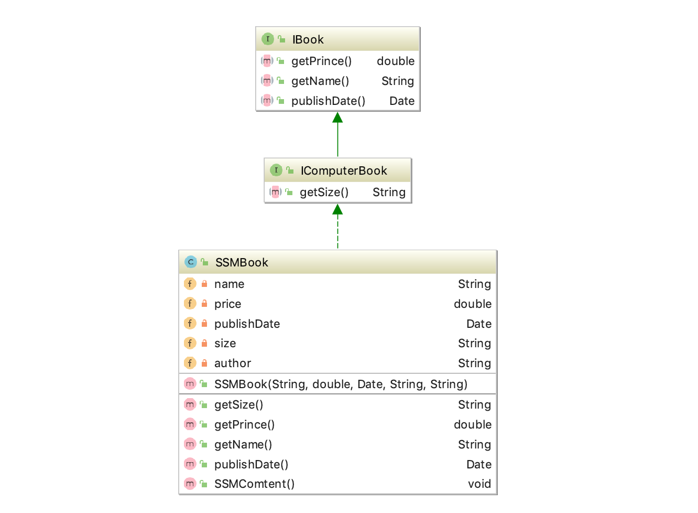
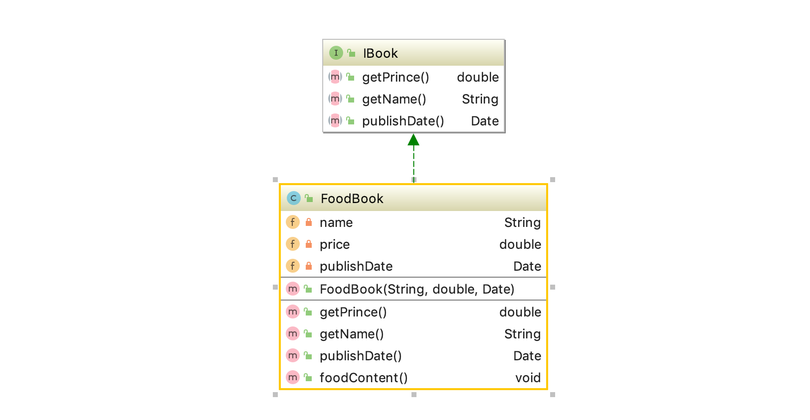

## 前言

在软件开发中，为了提高软件系统的可维护性和可复用性，增加软件的可扩展性和灵活性，程序员要尽量根据 7 条原则来开发程序，从而提高软件开发效率、节约软件开发成本和维护成本。我们将在下面的几节中依次来介绍这 7 条原则，本节首先介绍开闭原则。

## 开闭原则定义

开闭原则规定“软件中的对象（类，模块，函数等等）应该**对于扩展是开放的，但是对于修改是封闭的**”，这意味着一个实体是允许**在不改变它的源代码的前提下变更它的行为**。该特性在产品化的环境中是特别有价值的，在这种环境中，改变源代码需要代码审查，单元测试以及诸如此类的用以确保产品使用质量的过程。遵循这种原则的代码在扩展时并不发生改变，因此无需上述的过程。

我们通常在程序设计中利用接口、抽象类、继承和实现等方式来体现开闭原则。

## 开闭原则作用

开闭原则是面向对象程序设计的终极目标，它使软件实体拥有一定的适应性和灵活性的同时具备稳定性和延续性。具体来说，其作用如下

1. **对软件测试的影响**
软件遵守开闭原则的话，软件测试时只需要对扩展的代码进行测试就可以了，因为原有的测试代码仍然能够正常运行。
2. **可以提高代码的可复用性**
粒度越小，被复用的可能性就越大；在面向对象的程序设计中，根据原子和抽象编程可以提高代码的可复用性。
3. **可以提高软件的可扩展性和可维护性**
遵守开闭原则的软件，其稳定性高和延续性强，从而易于扩展和维护。

## 开闭原则案例

### 1. 描述

我们设计图书接口、电子书接口、以及SSM电子书类和美食书籍类。电子书接口通过继承图书接口，对其进行了扩展，增加了`getSize()`方法，即获取电子书内存大大小。SSM电子书类通过实现电子书接口进一步扩展，增加了`SSMComtent`方法。美食书籍类通过实现图书接口，同样实现了扩展的方法。

以后如果我们有了更多的武侠类、游戏类……等书籍，不需要对原来的图书接口进行修改，只需要继承完成扩展即可。

### 2. uml 图





### 3. 具体代码

图书接口

```java
import java.util.Date;

/**
 * 图书接口
 * 价格、书名、出版日期
 */
public interface IBook {
    double getPrince();
    String getName();
    Date publishDate();
}
```

电子书接口，扩展了一个方法获取电子书所占大小的方法。

```java
/**
 * 电子书接口
 */
public interface IComputerBook extends IBook{
    /**
     * 获取电子书大小 16kb
     * */
    String getSize();
}
```

实现图书接口实现扩展。

```java
import java.util.Date;

public class FoodBook implements IBook{

    private String name;
    private double price;
    private Date publishDate;

    public FoodBook(String name, double price, Date publishDate) {
        this.name = name;
        this.price = price;
        this.publishDate = publishDate;
    }

    @Override
    public double getPrince() {
        return price;
    }

    @Override
    public String getName() {
        return name;
    }

    @Override
    public Date publishDate() {
        return publishDate;
    }

    public void foodContent() {
        System.out.println("美食书籍: " + name + "-内容丰富哦!仅需要" + price +"元");
    }
}
```

 实现电子书接口实现扩展。

```java
import java.util.Date;
public class SSMBook implements IComputerBook {

    private String name;
    private double price;
    private Date publishDate;
    private String size;
    private String author;

    public SSMBook(String name, double price, Date publishDate, String size, String author) {
        this.name = name;
        this.price = price;
        this.publishDate = publishDate;
        this.size = size;
        this.author = author;
    }

    @Override
    public String getSize() {
        return size;
    }

    @Override
    public double getPrince() {
        return price;
    }

    @Override
    public String getName() {
        return name;
    }

    @Override
    public Date publishDate() {
        return publishDate;
    }

    public void SSMComtent() {
        System.out.println("SSM架构实战书籍:" + name + "-作者:" + author);
    }
}
```

测试类

```java
import java.util.Date;

public class Main {
    public static void main(String[] args) {
        FoodBook foodBook = new FoodBook("厨房秘籍", 30.00, new Date());
        showBookConten(foodBook);

        SSMBook ssmBook = new SSMBook("ssm架构", 57.20, new Date(), "20MB", "anben");
        showBookConten(ssmBook);
    }

    private static void showBookConten(IBook iBook) {
        if (iBook instanceof IComputerBook) {
            SSMBook ssmBook = (SSMBook) iBook;
            ssmBook.SSMComtent();
        } else {
            FoodBook foodBook = (FoodBook) iBook;
            foodBook.foodContent();
        }
    }
}
```

测试结果

```
美食书籍: 厨房秘籍-内容丰富哦!仅需要30.0元
SSM架构实战书籍:ssm架构-作者:anben
```

