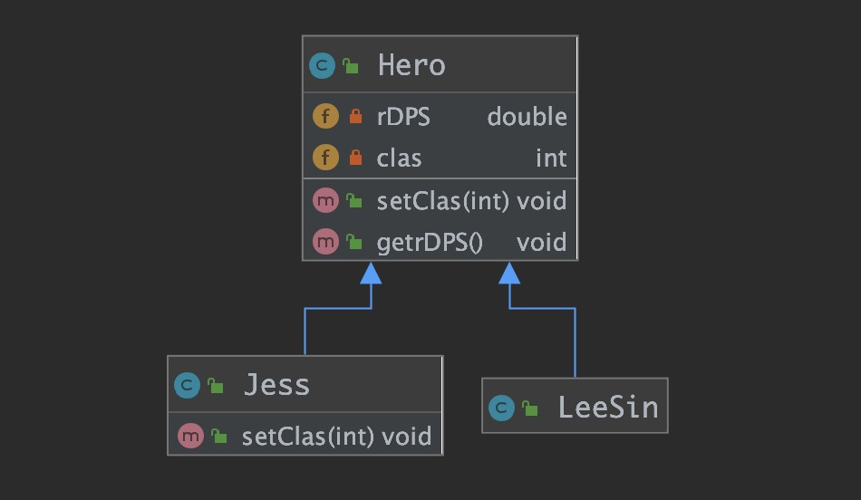

# 定义

Liskov于1987年提出了一个关于继承的原则“Inheritance should ensure that any property proved about supertype objects also holds for subtype objects.”—— **继承必须确保超类所拥有的性质在子类中仍然成立**.。**通俗的来讲就是子类可以扩展父类的功能，但是不能改变父类原有的功能。**

该原则称为Liskov Substitution Principle——里氏替换原则。

里氏替换原则主要阐述了有关继承的一些原则，也就是什么时候应该使用继承，什么时候不应该使用继承，以及其中蕴含的原理。里氏替换原是继承复用的基础，它反映了基类与子类之间的关系，是对开闭原则的补充，是对实现抽象化的具体步骤的规范。


# 意义

1. 防止重写父类方法，出现父类复用性差的情况。

2. 程序运行正确性的保证，即类的扩展不会给系统带来新的错误，降低了出错的可能性。因为子类重写了父类方法，在使用多态特性时，程序可能会出现不可预知的错误。


# 做法

+ 子类可以实现父类的抽象方法，但不能覆盖父类的非抽象方法。

+ 子类中可以增加自己特有的方法。

+ 当子类的方法重载父类的方法时，方法的前置条件（即方法的形参）要比父类方法的输入参数更宽松。

+ 当子类的方法实现父类的抽象方法时，方法的后置条件（即方法的返回值）要比父类更严格。


# 实践

在英雄联盟中，每个英雄到了6级都会拥有大招，大招的效果随着英雄等级提升而提升，盲僧的大招有伤害，杰斯的大招只是切换形态，没有伤害。我们在杰斯类中覆盖了父类的方法，导致调用`getrDPS()`方法出现了意料之外的错误。

（后话系列）对于这种情况我们应该将Hero再细分为两种子类，一种是大招有伤害类型，一种是无伤害类型，LeeSin和Jess分别继承他们，将Hero做成顶级类，只拥有管理等级的功能。

## uml图




## 代码部分

英雄基类

```java
/**
 * 英雄基类
 */
public class Hero {
    /** R 技能伤害 */
    private double rDPS;

    /** 英雄等级 */
    private int clas;

    public void setClas(int clas){
        this.clas = clas;
    }

    /**
     * R技能伴随等级的变化
     */
    public void getrDPS(){
        rDPS = 2100 / clas * 3.97;
        System.out.println("R技能的伤害为" + rDPS);
    }
}
```

盲僧

```java
/**
 * 盲僧
 */
public class LeeSin extends Hero{}
```

杰斯

```java
/**
 * 杰斯
 */
public class Jess extends Hero{
    @Override
    public void setClas(int clas) {
        System.out.println("虽然我到6了，但咱大招么得伤害呀，就不用传值等级了，反正也没用");
    }
}
```

测试类

```java
public class Main {
    public static void main(String[] args) {
        Hero leeSin = new LeeSin();
        leeSin.setClas(6);
        leeSin.getrDPS();

        Hero jess = new Jess();
        jess.setClas(6);
        jess.getrDPS();
    }
}
```

因为杰斯大招没伤害，重写了父类的`setClas(int clas)`方法没有为clas赋值，故而在计算R技能伤害时发生了除零异常。

```
R技能的伤害为1389.5
虽然我到6了，但咱大招么得伤害呀，就不用传值等级了，反正也没用
Exception in thread "main" java.lang.ArithmeticException: / by zero
```

